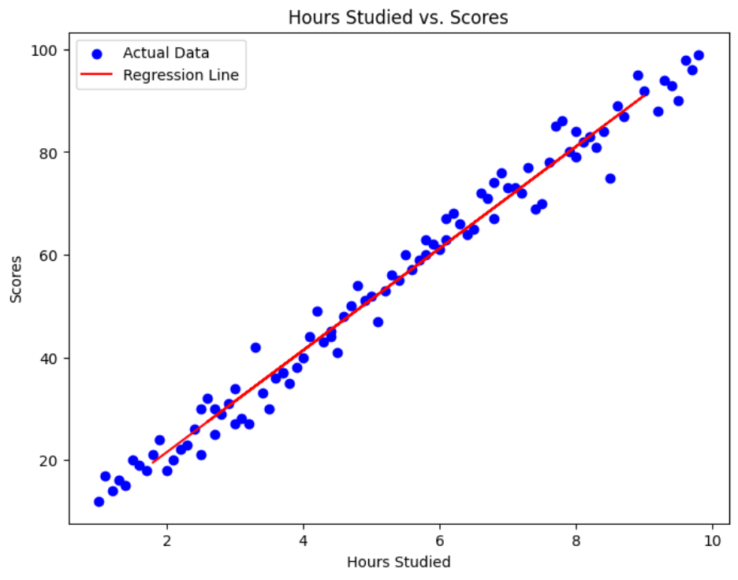

# Student Performance Prediction Model

Welcome to the **Student Performance Prediction Model** repository! This project is a machine learning model that predicts student scores based on the number of hours studied. 

## Table of Contents

- [Introduction](#introduction)
- [Dataset](#dataset)
- [Model Overview](#model-overview)
- [Installation](#installation)
- [Usage](#usage)
- [Results](#Results)

## Introduction

This project is focused on building a linear regression model to predict student performance based on the hours studied. The model was developed using Python and Flask and is intended to serve as a practical demonstration of my skills in data science and machine learning.

## Dataset

The dataset used in this project includes the following columns:

| Hours Studied | Scores |
|---------------|--------|
| 2.5           | 21     |
| 5.1           | 47     |
| 3.2           | 27     |
| 8.5           | 75     |
| 3.5           | 30     |
| 1.5           | 20     |
| 9.2           | 88     |
| 5.5           | 60     |
| 8.3           | 81     |
| 2.7           | 25     |
| 7.7           | 85     |
| 5.9           | 62     |

> **Note**: This dataset is sourced from [Kaggle's Student Study Hours Dataset](https://www.kaggle.com/datasets/himanshunakrani/student-study-hours).

## Model Overview

The model was built using the following steps:

1. **Data Collection**: The dataset was sourced from [Kaggle's Student Study Hours Dataset](https://www.kaggle.com/datasets/himanshunakrani/student-study-hours).
2. **Data Preprocessing**: The data was cleaned and prepared for modeling.
3. **Modeling**: A linear regression model was trained to predict student scores.
4. **Deployment**: The model was deployed as a web application using Flask.

### Key Features

- **Simple and Intuitive**: Easy-to-understand linear regression model.
- **Web Interface**: Users can input study hours through a web interface and receive predicted scores.
- **Educational**: Aimed at beginners looking to understand basic machine learning concepts and web development using Flask.

## Installation

To run this project locally, follow these steps:

1. Clone the repository:
   
       git clone https://github.com/kevin-babu-dotcom/StudentScoreModel.git
2. Navigate to the repository
   
       cd StudentScoreModel
3. Install the required dependencies:

        pip install -r requirements.txt
4. Create a virtual environment (optional but recommended):

         python -m venv venv
         venv\Scripts\activate`
5. Install the required dependencies:
        
        pip install -r requirements.txt
## Usage

To use the model, follow these steps:

1. Run the Flask Application: Make sure you are in the project directory, then run:

        python app.py
2. Access the Web Application: Open your web browser and go to http://127.0.0.1:5000/.

3. Input Study Hours: On the web page, enter the number of study hours in the input field and submit the form to get the predicted score.

## Results

Here is a plot showing the relationship between hours studied and scores
The script generates a scatter plot showing the correlation between the hours studied and the grades. The regression line is also plotted, showing the linear relationship established by the model:

         plt.figure(figsize=(8, 6))
         plt.scatter(X, y, color='blue', label='Actual Data')
         plt.plot(X_test, model.predict(X_test), color='red', label='Regression Line')
         plt.title('Hours Studied vs. Scores')
         plt.xlabel('Hours Studied')
         plt.ylabel('Scores')
         plt.legend()
         plt.show()

  

